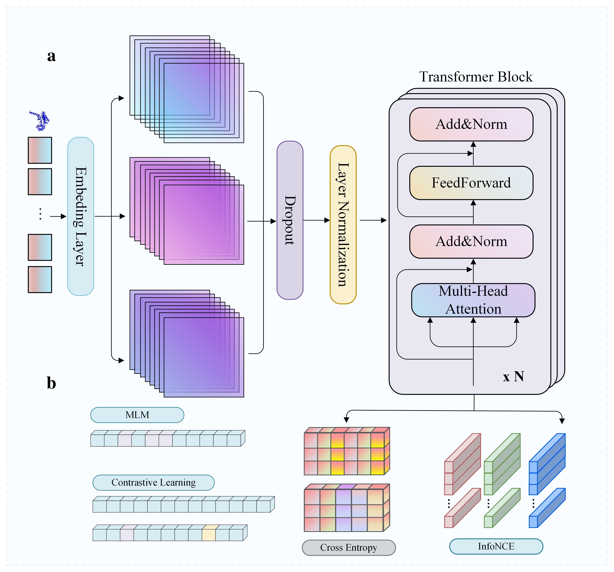

# TinyProteinTransformer (TPT)

A lightweight CNN-Transformer hybrid encoder for microbial smORF-encoded small proteins, pretrained on the Global Microbial smORF Catalog (GMSC; >280M sequences) with masked language modeling and contrastive learning.
---

```
╔═══════════════════════════════════════════╗
║                                           ║
║        _______ _____ _______              ║
║       |__   __|  __ \__   __|             ║
║          | |  | |__) | | |                ║
║          | |  |  ___/  | |                ║
║          | |  | |      | |                ║
║          |_|  |_|      |_|                ║
║                                           ║
║     ▸ TINY  PROTEIN  TRANSFORMER ◂        ║
║                                           ║
╚═══════════════════════════════════════════╝
```

## Repository Structure

```                 
├── weights/
│   ├── best_pretrain.pt         # Pretrained on GMSC10.90
│   └── Ablation/
│       ├── TPT_Weight/               # Baseline pretrained weights 
│       ├── TPT_Contrast_Weight/      # w/o contrastive loss
│       ├── TPT_Without_Attenpool_weight/
│       └── TPT_Without_CNN_Weight/
├── data/
│   └── GMSC10.90AA.faa               # GMSC pretraining corpus (too large to be placed here)
├── pretrain.py                       # Main pretraining on full GMSC corpus
│   
└── scripts/            
    ├── pretrain_ablation.py          # Ablation pretraining (no CL / attn pool / CNN)
    ├── pretrain_dim_sweep.py         # Hidden dim sweep (320 / 480 / 800)
    ├── finetune_ablation.py          # Downstream eval for ablation variants
    ├── finetune_dim_sweep.py         # Downstream eval for dim sweep variants
    ├── eval_ampscanner_amplify.py    # AMP Scanner v2 + AMPlify baselines
    ├── eval_fastmcws.py              # FastMCWS baseline
    ├── eval_qsp_cpp.py               # additional QSP CPP eval
    ├── check_overlap.py              # GMSC vs downstream overlap (exact + MMseqs2)
    ├── tsne_viz.py                   # t-SNE visualization + silhouette scores
    └── mcws_analysis.py              # MCWS-Transformer reference implementation
```

---
## Architecture

<p align="center"></p>

**(a)** Embedding layer feeds three parallel branches into stacked Transformer blocks (Multi-Head Attention + FeedForward, ×N layers) with Dropout and Layer Normalization. **(b)** Pretraining objectives: masked language modeling (MLM) and contrastive learning, optimized jointly via cross-entropy and InfoNCE loss.


---

## Weights

Download from Hugging Face: https://huggingface.co/ffbond/TinyProteinTransformer 

---

## Pretraining

**GMSC** 

```bash
# Place corpus at data/GMSC10.90AA.faa
python scripts/pretrain.py
```

Checkpoints saved to `checkpoint.pt`; best weights to `best_pretrain_288M.pt`.

**Ablation pretraining**:

```bash
# Trains three variants: w/o contrastive loss, w/o attention pooling, w/o CNN
python scripts/pretrain_ablation.py

# Hidden dim sweep: 320, 480, 800 (default is 640)
python scripts/pretrain_dim_sweep.py
```

Ablation weights saved to `Ablation/<variant>/best_pretrain.pt`.

**Key hyperparameters:**

| Parameter | Value |
|---|---|
| Hidden dim | 640 |
| Transformer layers | 20 |
| CNN kernel sizes | 3, 5, 7, 9 |
| Pretraining LR | 2e-5 (AdamW) |
| Contrastive loss weight λ | 0.05 |
| Contrastive temperature τ | 0.1 |
| Max sequence length | 128 |
| Batch size | 200 / 64 (ablation)|

---

## Inference

```python
import torch
from model import TinyProteinTransformer
from utils import build_tokenizer

tokenizer = build_tokenizer()
model = TinyProteinTransformer(vocab_size=len(tokenizer))
model.load_state_dict(torch.load("weights/best_pretrain_288M.pt"))
model.cuda().eval()

def encode(seq, max_len=128):
    ids = [tokenizer.get(aa, tokenizer["X"]) for aa in seq][:max_len]
    ids += [tokenizer["PAD"]] * (max_len - len(ids))
    return torch.tensor(ids).unsqueeze(0).cuda()

with torch.no_grad():
    x = encode("MKVLILACLVVVTITVS")
    h = model.encode(x)              # (1, L, 640) residue-level representations
    embedding = model.attention_pool(h)  # (1, 640) sequence embedding
```

For classification, attach a additional classifier on top of `embedding`.

---

## Fine-tuning / Downstream Evaluation

All downstream tasks use **5-fold stratified CV** (`StratifiedKFold(random_state=42)`), frozen encoder + single linear head, AdamW (lr=1e-3), 5 epochs. Input CSV format:

```
Sequence,label
MKVLIL...,1
ACDEFG...,0
```

```bash

python scripts/finetune_ablation.py

python scripts/finetune_dim_sweep.py

python scripts/eval_qsp_cpp.py
```

Supported datasets: `AMP_amplify.csv`, `tox.csv`, `QSP.csv`, `CPP.csv`, `Acr.csv`, `BCN.csv`.

---

## Baseline Comparisons

All baselines trained from scratch with the same 5-fold CV protocol, early stopping on val ACC (patience=10, max 200 epochs):

```bash
# AMP Scanner v2 (Veltri et al., 2018) + AMPlify (Li et al., 2022)
python scripts/eval_ampscanner_amplify.py

# FastMCWS (Mahala et al., 2025)
python scripts/eval_fastmcws.py
```

Results logged to `./log/` as CSV files.

---

## Data Overlap Analysis

Check for sequence leakage between GMSC pretraining and downstream datasets (exact match + MMseqs2 at ≥90% identity):

```bash
# Requires MMseqs2 on PATH (conda install -c bioconda mmseqs2)
python scripts/check_overlap.py
```

Outputs: `./log/overlap_report.txt`, `./log/overlap_exact.csv`.

---

## Visualization

t-SNE projections and silhouette scores comparing TPT, ESM2-35M, ESM2-150M, ProtBERT:

```bash
python scripts/tsne_viz.py
```

Plots saved to `./VisulPlot/`.


---

## Requirements

```bash
pip install torch numpy pandas scikit-learn biopython matplotlib tqdm transformers fair-esm umap-learn
conda install -c bioconda mmseqs2  # for overlap analysis only
```

---

## Citation

```bibtex
@article{sheng2026tpt,
  title={TPT: A Compact CNN-Transformer Encoder for Efficient Microbial Small Protein Modeling},
  author={Sheng, Fang and Zhang, Junhe and Zhu, Chengkai},
  journal={Frontiers in },
  year={2026}
}
```
